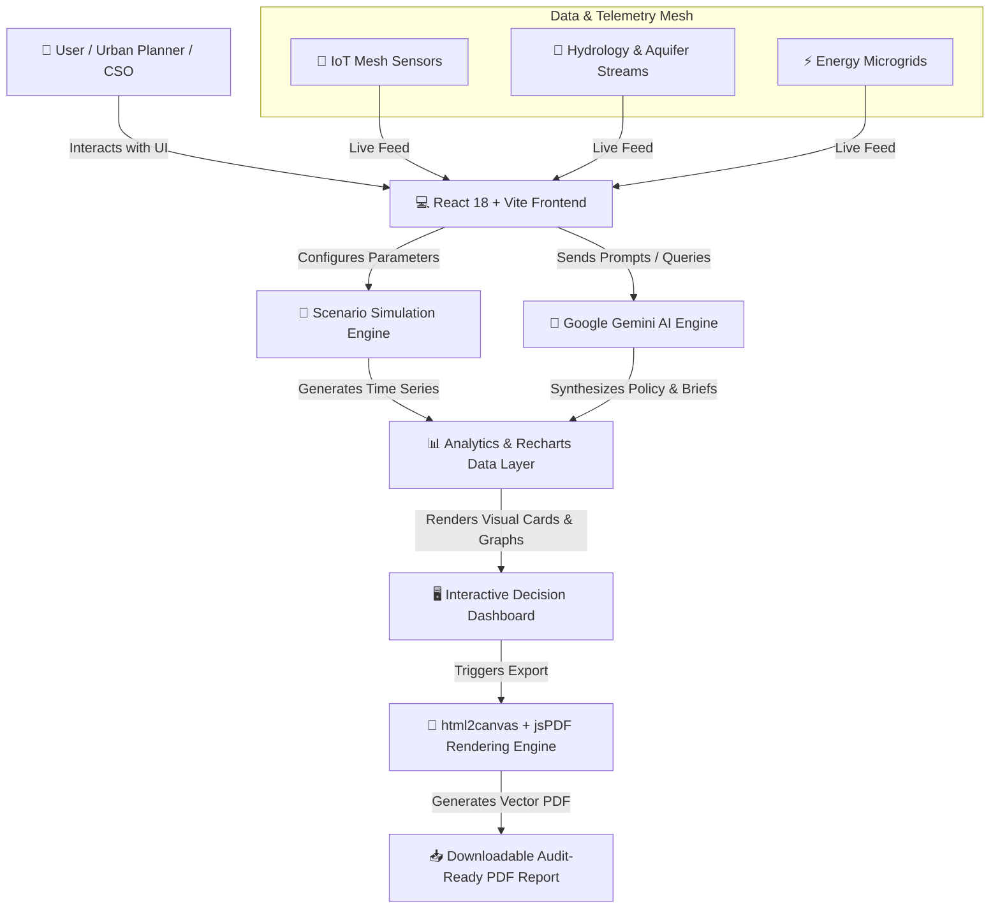

<p align="center">
  <a href="#-ecotwin-ai">
    
  </a>
</p>

<p align="center">
  
</p>

<h1 align="center">🌍 EcoTwin AI</h1>

<p align="center">
  <strong>Predict Today. Protect Tomorrow.</strong>
</p>

<p align="center">
  EcoTwin AI is a next-generation, AI-powered Digital Twin platform designed to empower municipal governments, urban planners, environmental researchers, and enterprise sustainability leaders with predictive environmental intelligence, physics-informed climate scenario simulations, and automated governance decision support.
</p>

<p align="center">
  <a href="https://react.dev/"></a>
  <a href="https://www.typescriptlang.org/"></a>
  <a href="https://vitejs.dev/"></a>
  <a href="https://tailwindcss.com/"></a>
  <a href="https://deepmind.google/technologies/gemini/"></a>
  <a href="https://recharts.org/"></a>
  <a href="./LICENSE"></a>
</p>

<p align="center">
  <a href="[Add Live Website URL]"></a>
  <a href="[Add Demo Video Link]"></a>
  <a href="[Add Google Slides / PDF Link]"></a>
  <a href="#-22-documentation"></a>
  <a href="[Add GitHub Repository Link]"></a>
</p>

<br />

> [!NOTE]
> 💡 **Why EcoTwin AI?**  
> Traditional urban dashboards are static rear-view mirrors that rely solely on historical data, rendering them incapable of forecasting compound climate risks or evaluating policy interventions before capital deployment. EcoTwin AI bridges this critical gap by unifying real-time environmental IoT sensor streams, physics-informed climate simulation engines, and Google Gemini AI into a predictive decision engine for proactive climate resilience.

<br />

---

## ⚠️ 8. Problem Statement

Global urban centers occupy only 3% of Earth's land surface but account for over 70% of global carbon emissions and consume 78% of the world's energy. As climate volatility intensifies:

- **Extreme Weather Vulnerability:** Floods, thermal heat domes, and wildfires cause over $300B in annual infrastructure damage globally.
- **Data Fragmentation:** Urban leaders face an overwhelming deluge of disparate data streams (telemetry, satellite imagery, traffic sensors, weather radar) without an intelligence layer to synthesize actionable insights.
- **Inadequate Static Dashboards:** Legacy BI tools display what *already happened*, but offer zero capability to simulate *what will happen* if temperatures rise by +2.0°C or if 500kW solar microgrids are deployed in high-density corridors.

> 🚨 **The Verdict:** Traditional monitoring dashboards are static rear-view mirrors. Modern climate resilience demands predictive forward-looking digital twins.

---

## 🛡️ 9. Our Solution

**EcoTwin AI** redefines environmental governance by delivering a multi-dimensional Digital Twin engine backed by generative intelligence.

```
┌─────────────────────────────────────────────────────────────────────────────┐
│                              ECOTWIN AI PLATFORM                            │
├───────────────────────────────┬───────────────────────────────┬─────────────┤
│   AI SCENARIO SIMULATOR       │    ENVIRONMENTAL INTELLIGENCE │  POLICIES   │
│   • Heat Island Mitigation    │    • Scope 1/2/3 Carbon       │  • AI Brief │
│   • Hydrodynamic Flood Models │    • Aquifer & Water Shortage │  • SEC / ISO│
│   • Renewable Microgrids      │    • IoT Mesh Sensor Nodes    │    Audits   │
└───────────────────────────────┴───────────────────────────────┴─────────────┘
```

- **Interactive Climate Simulator:** Real-time physics and parameter tuning (Temperature, Precipitation, Green Canopy %, Industrial Output, EV Adoption %).
- **AI Policy Advisor:** Natural language policy generation transforming complex climate datasets into executive briefings and budget roadmap recommendations.
- **Automated High-Res PDF Reporting:** Client-side document generation using custom sanitization engines that convert modern color spaces into high-definition vector PDF reports.

---

## ✨ 10. Key Features

### 🎛️ 1. Executive Twin Dashboard
- Multi-region spatial viewport (Silicon Valley Corridor, Pacific Northwest, Gulf Coast, Metro Innovation Zone).
- Real-time Air Quality Index (AQI), Carbon Offsets (tCO₂e), Water Storage Capacities (Mgal), and Renewable Energy Fraction (%).

### 🧪 2. Multi-Variable Scenario Simulator
- Dynamic sliders for temperature anomalies (+0.5°C to +4.0°C), urban green canopy percentage, EV transition rates, and industrial abatement.
- Immediate visual impact feedback across carbon pathways, municipal financial expenditures, and public health scores.

### 🍀 3. Scope 1, 2, & 3 Carbon Intelligence
- Comprehensive carbon scope decomposition, sector-by-sector emission breakdown (Transport, Buildings, Energy, Industry).
- Predictive 2040 Net-Zero pathway models contrasting business-as-usual (BAU) against AI-optimized trajectories.

### 🌊 4. Disaster & Flood Prediction Engine
- High-resolution flood risk zonings, storm surge threat level warnings, and evacuation zone impacts.
- Pre-disaster mitigation playbooks with estimated infrastructure damage costs and emergency shelter readiness.

### 💧 5. Water Intelligence & Aquifer Resilience
- Reservoir storage monitoring, groundwater table depletion rates, rainfall deficit forecasts, and pipe leakage telemetry alerts.

### ⚡ 6. Renewable Energy & Microgrid Planner
- Solar irradiance map overlays, wind kinetic potential models, battery storage capacity (MWh), and financial ROI paybacks.

### ♻️ 7. Smart Waste & Circular Economy Management
- Waste stream routing optimization, landfill diversion tracking, and methane recovery efficiency metrics.

### 🤖 8. AI Policy Advisor & Governance
- AI-synthesized policy briefs with cost-benefit analysis, SDG alignment grids, risk assessments, and multi-phase rollout timelines.

### 📈 9. Deep Analytics Engine
- Time-series trend visualizers, cross-metric correlations, and sensor health status monitors.

### 📄 10. Audit-Ready PDF Report Exporter
- Complete client-side PDF document generation featuring high-DPI canvas capture, custom page numbering, executive summary cards, and SDG compliance tags.

---

## 📸 11. Screenshots

### 🖼️ 1. Executive Twin Viewport Dashboard
> *Real-time spatial overview of regional environmental health and primary KPI cards.*


### 🖼️ 2. Climate Scenario Simulator
> *Simulating thermal reduction and carbon output based on urban green canopy and EV adoption rates.*


### 🖼️ 3. Carbon Intelligence & Scope 1/2/3 Analytics
> *Sector emission breakdown and 2040 net-zero trajectory forecasts.*


### 🖼️ 4. Disaster & Inundation Prediction Engine
> *Simulating storm surge inundation levels and affected municipal infrastructure zones.*


### 🖼️ 5. Water Intelligence & Aquifer Resilience
> *Groundwater table monitoring, reservoir levels, and municipal pipe leak detection.*


### 🖼️ 6. Renewable Energy & Microgrid Planner
> *Solar potential, wind speed modeling, battery storage dispatch, and payback period calculations.*


### 🖼️ 7. Deep Environmental Analytics
> *Comparative historical trends, multi-variable correlation charts, and sensor mesh health.*


### 🖼️ 8. AI Policy Advisor & Executive PDF Export
> *Generative policy brief breakdown and immediate client-side PDF document download.*


---

## 🏗️ 12. Architecture Diagram



---

## 🛠️ 13. Technology Stack

| Category | Technology | Purpose |
| :--- | :--- | :--- |
| **Frontend Framework** | `React 18.3` | Modern, component-driven UI architecture |
| **Language** | `TypeScript 5.5` | Strict end-to-end type safety |
| **Build Tool** | `Vite 6.0` | Ultra-fast HMR and bundling |
| **Styling & UI** | `Tailwind CSS 3.4` | Responsive, utility-first dark/light styling |
| **Icons** | `Lucide React` | Consistent modern visual iconography |
| **Artificial Intelligence** | `Google Gemini API (@google/genai)` | Generative environmental synthesis & policy briefs |
| **Data Visualization** | `Recharts 2.12` | High-performance interactive charts & graphs |
| **PDF Generation** | `jsPDF` + `html2canvas` | High-DPI client-side vector document export |
| **Server Runtime** | `Express` + `Node.js` | API proxy and static asset delivery |
| **Deployment** | `Cloud Run` / Containerized | Scalable microservices execution |

---

## 📁 14. Project Structure

```text
ecotwin-ai/
├── public/                     # Static assets and favicon
├── src/
│   ├── components/             # Reusable UI components
│   │   ├── layout/             # Top Navbar, Sidebar navigation, Footer
│   │   └── ui/                 # Modals, badges, stat cards, toast containers
│   ├── data/                   # Mock telemetry, twin regions, and preset report datasets
│   │   ├── mockTwinData.ts     # Primary environmental sensor and simulation data
│   │   └── mockReportingData.ts# Comprehensive executive report templates
│   ├── pages/                  # Main platform modules & viewports
│   │   ├── Dashboard.tsx       # Primary Executive Digital Twin Overview
│   │   ├── ScenarioSimulator.tsx# Interactive Climate Scenario Engine
│   │   ├── CarbonAnalytics.tsx # Scope 1/2/3 Carbon Intelligence
│   │   ├── DisasterPrediction.tsx# Inundation & Storm Surge Prediction
│   │   ├── WaterIntelligence.tsx# Aquifer & Reservoir Resilience
│   │   ├── RenewableEnergyPlanner.tsx# Solar, Wind, and Microgrid Planning
│   │   ├── AIPolicyAdvisor.tsx # Generative AI Policy Brief Engine
│   │   ├── ExecutiveReports.tsx# Audit-Ready PDF Export Hub
│   │   ├── IoTMesh.tsx         # Sensor mesh health & telemetry logs
│   │   ├── DigitalTwinViewport.tsx# 3D spatial viewport engine
│   │   └── CommunityImpact.tsx # Citizen engagement & local action
│   ├── utils/                  # Core helper modules
│   │   └── pdfExport.ts        # Client-side PDF generator with CSS color parser
│   ├── types.ts                # Centralized TypeScript interfaces & type declarations
│   ├── App.tsx                 # Main application shell and route navigation
│   ├── main.tsx               # Client entry point
│   └── index.css               # Global Tailwind CSS import declarations
├── metadata.json               # Platform frame permissions & capabilities
├── package.json                # Project dependencies and script definitions
├── tsconfig.json               # TypeScript compiler configuration
├── vite.config.ts              # Vite bundle configuration
└── server.ts                   # Express development & production server
```

---

## ⚙️ 15. Installation & Setup

### Prerequisites
- **Node.js**: `v18.0.0` or higher
- **npm**: `v9.0.0` or higher

### 1. Clone the Repository
```bash
git clone https://github.com/placeholder/ecotwin-ai.git
cd ecotwin-ai
```

### 2. Install Dependencies
```bash
npm install
```

### 3. Environment Variables
Create a `.env` file in the root directory (refer to `.env.example`):
```env
GEMINI_API_KEY=your_google_gemini_api_key_here
PORT=3000
```

### 4. Run Development Server
```bash
npm run dev
```
Navigate to `http://localhost:3000` in your browser.

### 5. Production Build & Start
```bash
# Build the production bundle
npm run build

# Start the production Node server
npm run start
```

---

## 🎮 16. Usage Guide

1. **Select Regional Viewport:** Use the top region selector to switch between *Silicon Valley Corridor*, *Pacific Northwest*, *Gulf Coast*, or *Metro Innovation Zone*.
2. **Execute Climate Simulations:** Navigate to **Scenario Simulator**, adjust parameters like *Green Canopy Increase %* or *Target Year*, and click **Run Simulation** to compute environmental impact.
3. **Generate AI Policy Advice:** Open **AI Policy Advisor**, select a focus topic (e.g., *Urban Heat Island Abatement*), and trigger **Generate Policy Brief**.
4. **Export Audit-Ready PDF Reports:** Go to **Executive Reports**, pick a report type (*Carbon*, *Water*, *Energy*, or *Executive*), preview the generated metrics and charts, and click **Export PDF Report** for an instant download.

---

## 🧠 17. AI Workflow Architecture

```text
[ User Prompt / Scenario Configuration ]
                  │
                  ▼
┌──────────────────────────────────────────────────┐
│          Scenario Parameter Extraction           │
│  (Target Year, Temp Δ, Canopy %, EV Adoption %)  │
└──────────────────────────────────────────────────┘
                  │
                  ▼
┌──────────────────────────────────────────────────┐
│             Google Gemini AI Engine              │
│ - Analyzes spatial sensor baseline data           │
│ - Evaluates ISO 14064 & SEC ESG compliance       │
│ - Synthesizes actionable policy recommendations   │
└──────────────────────────────────────────────────┘
                  │
                  ▼
┌──────────────────────────────────────────────────┐
│           Physics-Informed Predictor             │
│ - Calculates carbon offset trajectories          │
│ - Models hydrodynamic flood risk contours        │
│ - Computes municipal ROI & payback years         │
└──────────────────────────────────────────────────┘
                  │
                  ▼
┌──────────────────────────────────────────────────┐
│        Interactive Visualizations & Reports      │
│ - Recharts time-series rendering                 │
│ - Client-side high-resolution PDF rendering      │
└──────────────────────────────────────────────────┘
```

---

## 🌍 18. Sustainability Impact

- **🍃 Environmental Benefits:** Enables municipal cities to reduce urban heat island temperatures by up to 2.4°C and accelerate carbon offset strategies toward 2040 targets.
- **💰 Economic Benefits:** Saves millions in pre-disaster flood mitigation and optimizes renewable energy capital investments with precise ROI payback forecasting.
- **🏛️ Government Benefits:** Cuts time spent compiling sustainability compliance reports from weeks to seconds.
- **🏢 Industry Benefits:** Provides CSOs with verifiable Scope 1, 2, and 3 data for ESG audits.
- **👥 Social Benefits:** Improves public health scores by mitigating PM2.5/AQI pollution exposure in vulnerable urban districts.

---

## 🎯 19. UN Sustainable Development Goals (SDG) Alignment

| SDG Icon | Goal | EcoTwin AI Feature Alignment |
| :---: | :--- | :--- |
| **SDG 6** | **Clean Water & Sanitation** | Water Intelligence module for groundwater aquifer monitoring, leak detection, and rainfall deficit forecasting. |
| **SDG 7** | **Affordable & Clean Energy** | Renewable Energy Planner for solar/wind potential modeling, microgrids, and battery storage optimization. |
| **SDG 9** | **Industry, Innovation & Infrastructure** | IoT Sensor Mesh and Digital Twin spatial simulation engines for resilient smart cities. |
| **SDG 11** | **Sustainable Cities & Communities** | Urban heat island mitigation, disaster inundation prediction, and citizen engagement metrics. |
| **SDG 12** | **Responsible Consumption & Production** | Circular economy smart waste tracking, diversion rates, and methane recovery monitoring. |
| **SDG 13** | **Climate Action** | Scope 1/2/3 carbon analytics, 2040 net-zero pathways, and generative AI climate policy briefs. |
| **SDG 15** | **Life on Land** | Urban canopy expansion modeling, forest corridor protection, and land degradation prevention. |

---

## 📈 20. Scalability & Deployment

- **🏙️ City Scale:** Single municipal jurisdiction managing local sensor nodes, waste routes, and neighborhood heat islands.
- **🏞️ State / Regional Scale:** Cross-county water basin management, regional grid load balancing, and state-wide flood warning networks.
- **🌐 National Scale:** Federal environmental agency oversight, inter-state carbon credit auditing, and disaster relief allocation.
- **🌍 Global Scale:** Multi-national sustainability benchmarks, international treaty compliance tracking, and global climate scenario comparisons.

---

## 🗺️ 21. Future Roadmap

- [ ] **🛰️ Satellite Data Integration:** Live Sentinel-2 and Landsat multispectral imagery ingestion.
- [ ] **📡 Hardware IoT Edge Sensors:** Direct MQTT/LoRaWAN sensor gateway drivers.
- [ ] **🚁 Autonomous Drone Surveillance:** Aerial thermal imaging for real-time wildfire detection.
- [ ] **🏙️ WebGL / Three.js 3D Viewport:** Immersive 3D photo-realistic city meshes with real-time shadow & wind flow vectors.
- [ ] **💱 Carbon Credit Marketplace:** Blockchain-verified carbon offset tokenization and trading ledger.
- [ ] **🔌 Public Climate REST & GraphQL APIs:** Developer API platform for third-party urban integrations.

---

## 📚 22. Documentation

For detailed technical specifications, consult the project documentation files:

- 📑 [`docs/Architecture.md`](./docs/Architecture.md) — System architecture, data flow, and server topology.
- 📐 [`docs/Technical_Report.md`](./docs/Technical_Report.md) — In-depth mathematical simulation formulas and algorithms.
- 🧪 [`docs/Evaluation.md`](./docs/Evaluation.md) — Benchmark performance metrics and AI response accuracy.
- 🔒 [`docs/Privacy_and_Safety.md`](./docs/Privacy_and_Safety.md) — Data encryption, security rules, and safety guidelines.
- 📜 [`docs/Attribution.md`](./docs/Attribution.md) — Open source library attributions and dataset citations.

---

## 📜 24. License

Distributed under the **MIT License**. See [`LICENSE`](./LICENSE) for more information.

---

<p align="center">
  <sub>Built with ❤️ for a climate-resilient future. EcoTwin AI © 2026.</sub>
</p>
